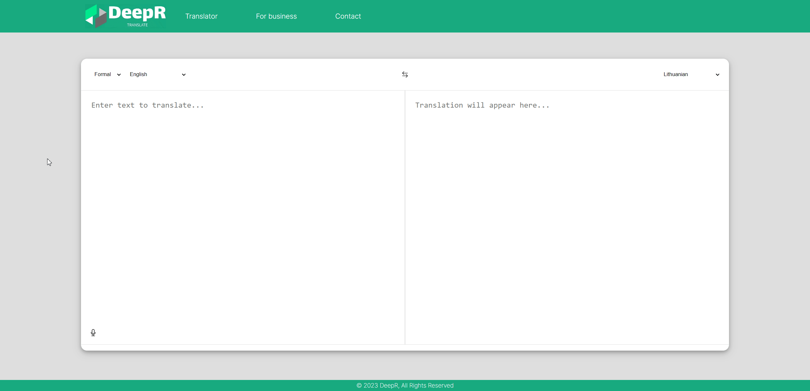

# **DeepR translate application**

**About the project**

DeepR is an innovative translation website that leverages OpenAI's powerful API to translate text. This application stands out by offering users the unique feature of selecting the type or style in which their text will be translated. It's designed to cater to a wide range of translation needs, making it suitable for both casual and professional purposes.

**Key features**

* Utilizes OpenAI API for accurate and efficient translations.
* Allows users to choose the translation style, enhancing the customization of the output.
* User-friendly interface for easy interaction and usage.
* Suitable for diverse translation needs, ranging from simple phrases to complex texts.

**Demos**

